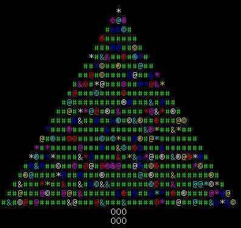

# Advent of Code 2018

https://adventofcode.com/

from: https://teampython.wordpress.com/2015/12/12/print-a-christmas-tree/

## About 

https://adventofcode.com/2018/about

Advent of Code is an Advent calendar of small programming puzzles for a variety of skill sets and skill levels that can be solved in any programming language you like. People use them as a speed contest, interview prep, company training, university coursework, practice problems, or to challenge each other.

You don't need a computer science background to participate - just a little programming knowledge and some problem solving skills will get you pretty far. Nor do you need a fancy computer; every problem has a solution that completes in at most 15 seconds on ten-year-old hardware.

## Register via [GitHub] [Google] [Twitter] [Reddit]

https://adventofcode.com/2018/auth/login
